# SnagList User Guide

SnagList lets staff report building and maintenance issues — `Snag`s — at a
company `Location`, and lets the maintenance team triage and resolve them.
Screenshots below were captured against the local Docker deployment (see
[`05-deployment-local-docker.md`](../specs/2026-09-27-snaglist/05-deployment-local-docker.md)).

There are two roles:

- **Staff** — reports `Snag`s, comments on them, and withdraws or edits their
  own reports while still `Reported`.
- **Maintenance** — triages `Snag`s (acknowledge, start work, resolve, close,
  reject) and manages `Location`s.

A staff member can also hold the Maintenance role, as the seeded `bob.maintenance`
account below does.

## Signing in

SnagList delegates sign-in to Keycloak. From any page, following **Log in**
redirects to the identity provider's sign-in screen:

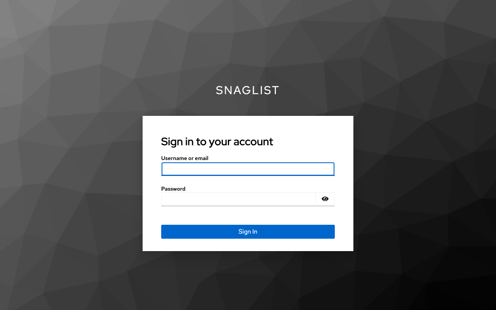

The local Docker deployment seeds two accounts for demos and testing:

| Username | Password | Roles |
| --- | --- | --- |
| `jane.smith` | `password` | Staff |
| `bob.maintenance` | `password` | Staff, Maintenance |

## Viewing Snags

After signing in, the **Snags** page lists every reported issue, with a
dropdown to filter by status:

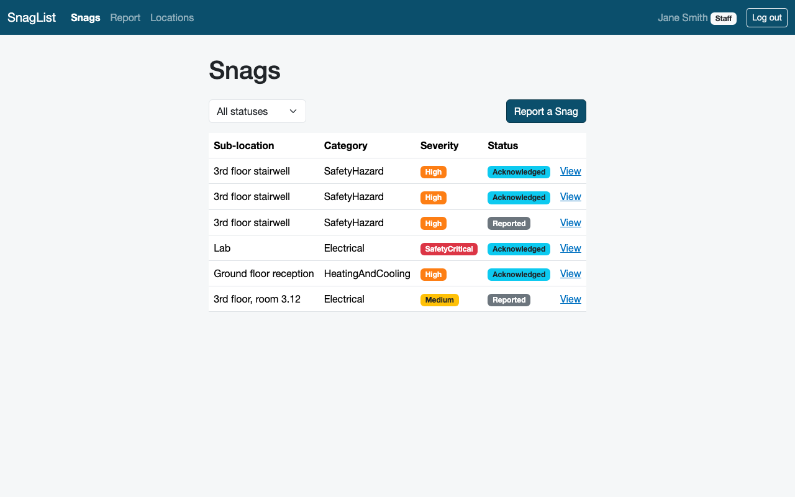

## Reporting a Snag

Following **Report** opens the report form. Choose the `Location`, describe
where at that `Location` the issue is, and set its category and severity:

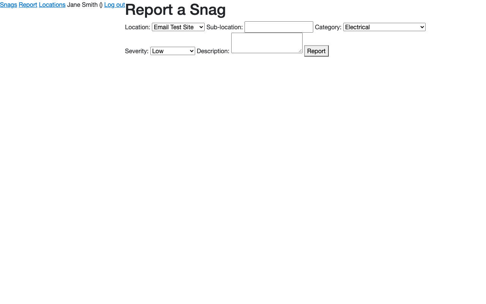

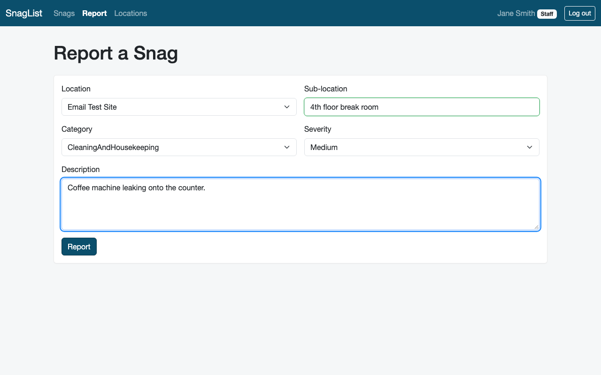

Submitting takes you straight to the new `Snag`'s detail page, showing its
status and the actions available to you. As the reporter, you can **Edit** or
**Withdraw** it while it is still `Reported`:

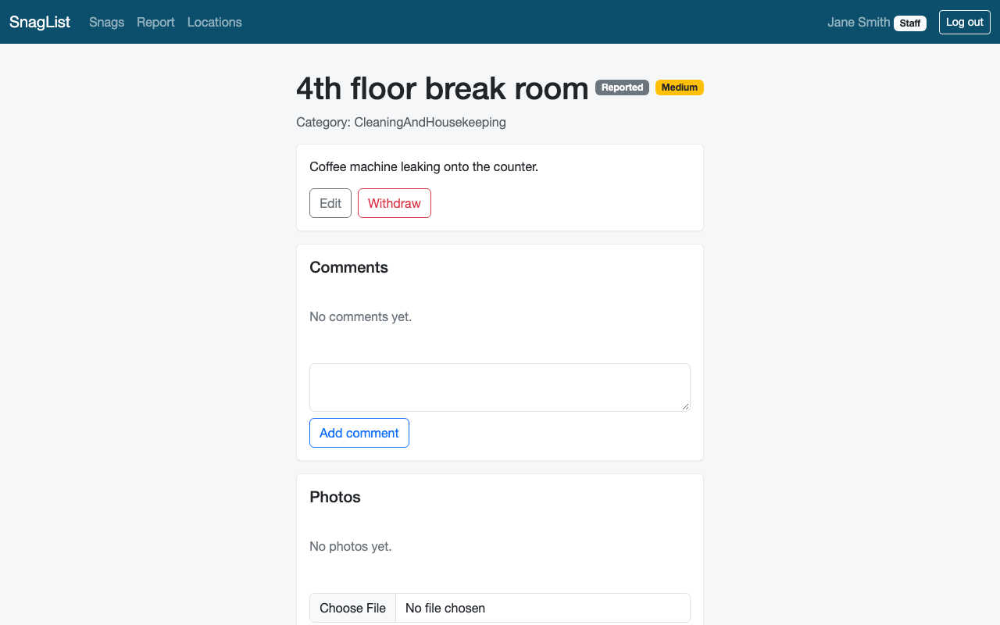

## Adding a photo

Open a `Snag` and scroll to **Photos**. On a mobile device with a camera, choose
**Take a photo**, allow camera access if your browser asks, then take and confirm
the picture. The camera picker prefers the rear camera when one is available.
Once the upload finishes, the picture appears in the Photos list. To select an
existing picture or another file, use **Upload a photo** instead.

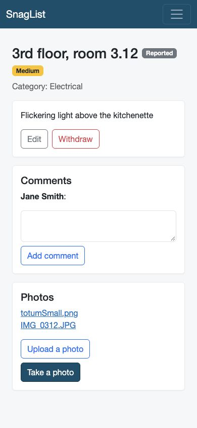

## Adding a comment

Anyone — Staff or Maintenance — can add a follow-up comment to a `Snag`,
regardless of its status:

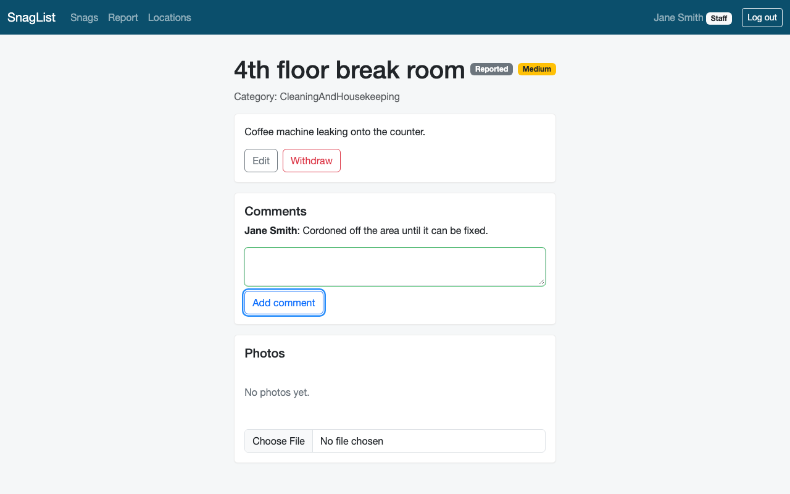

## Viewing Locations

The **Locations** page lists every site `Snag`s can be reported against:

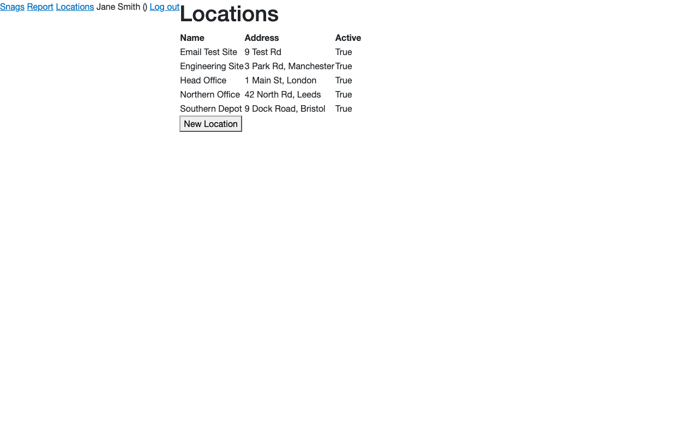

## Triaging a Snag (Maintenance)

Signed in as a Maintenance user, the **Snags** page is the same list, but
opening a `Reported` `Snag` now shows the triage actions instead:

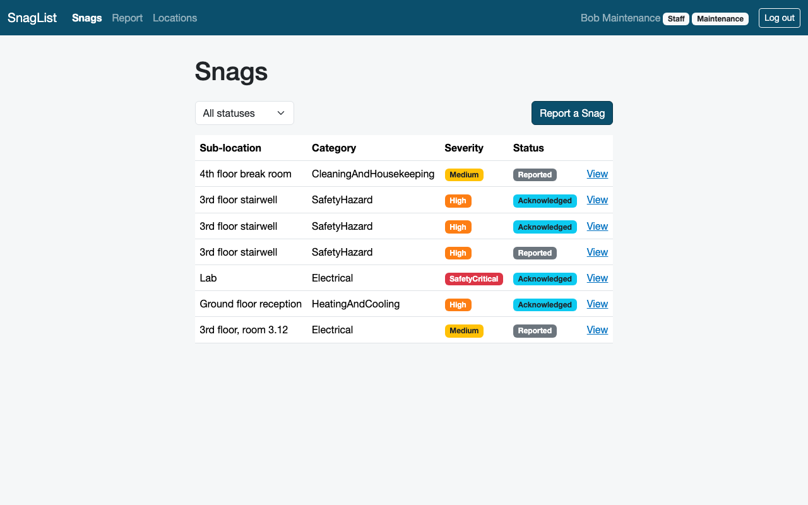

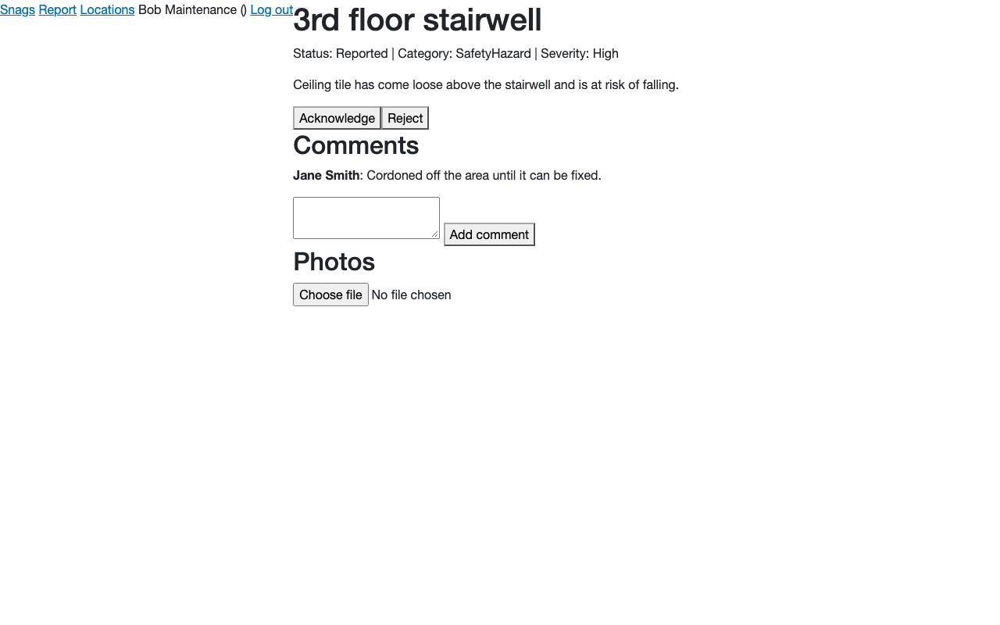

Following **Acknowledge** moves the `Snag` to `Acknowledged` and swaps in the
next actions (**Start work**, **Reject**):

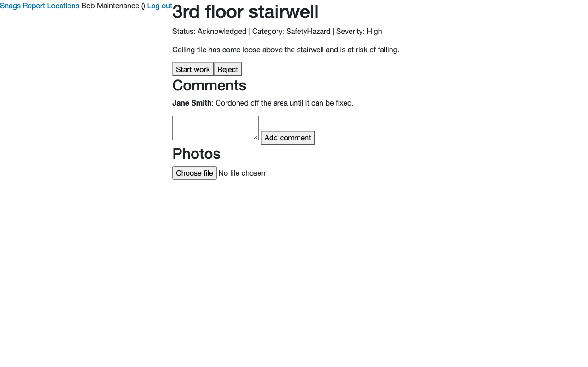

A `Snag` otherwise moves one-directionally through `Reported` → `Acknowledged`
→ `InProgress` → `Resolved` → `Closed`, with `Rejected` reachable from
`Reported` or `Acknowledged`.

## Managing Locations (Maintenance)

Only Maintenance can add a new `Location`, from the same **Locations** page:

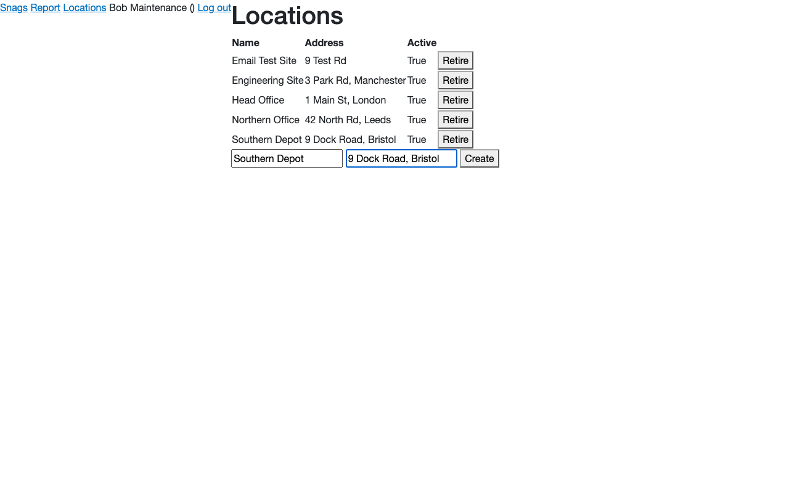

Retiring a `Location` hides it from the picker on the Report a Snag form
without deleting its history — existing `Snag`s still show it:

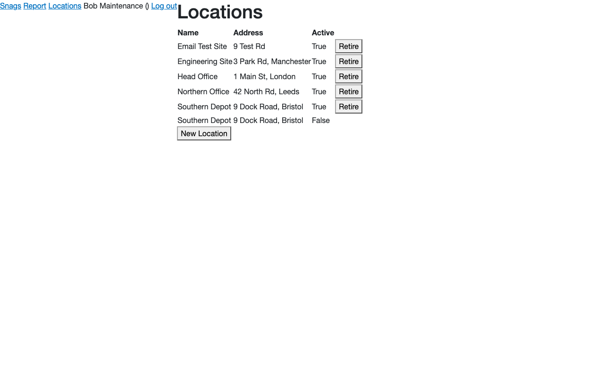
